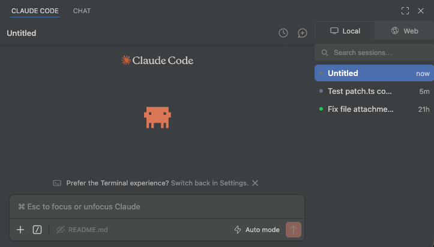

#  CCE Patch — Claude Code Extension Patcher

[](LICENSE)
[](#requirements)
[](#multi-editor-support)
[](#requirements)
[](#)

> **Persistent sessions sidebar + live status dots for the Claude Code VS Code extension.**

---

## Features

### Persistent Sessions Sidebar

The sessions list becomes a **permanent sidebar panel** (80/20 split) instead of a floating dropdown. No more opening and closing — all your sessions are always visible alongside the chat.

### Live Session Status Dots

Each session displays a colored status indicator:

| Dot | Status | Meaning |
|-----|--------|---------|
|  | **Done** | Task completed, not yet viewed |
|  | **Running** | Task is actively executing (pulsing) |
|  | **Waiting** | Needs user input (pulsing) |
|  | **Seen** | Task completed and already viewed |

### Screenshot



### Include Selection Default Off

The "Include Selection" toggle in the chat input defaults to **off** instead of on, preventing accidental context injection.

### Multi-Editor Support

Automatically detects and patches **all installed editors** in a single run:

| Editor | Extension Path |
|--------|---------------|
| VS Code Insiders | `~/.vscode-insiders/extensions/` |
| VS Code | `~/.vscode/extensions/` |
| Cursor | `~/.cursor/extensions/` |
| VSCodium | `~/.vscodium/extensions/` |

---

## Requirements

- **macOS, Linux, or WSL** (standard VS Code extension paths)
- **Claude Code extension** installed in at least one supported editor
- One of the following runtimes:
  - [Bun](https://bun.sh) (recommended — zero config)
  - [Node.js](https://nodejs.org) 18+ with `tsx`

---

## Usage

### With Bun (recommended)

```bash
# Apply patch to all detected editors
bun run patch.ts

# Revert all editors to original
bun run patch.ts --revert
```

### With npm / Node.js

```bash
# Install tsx globally (one-time)
npm install -g tsx

# Apply patch
tsx patch.ts

# Revert
tsx patch.ts --revert
```

Or without global install using `npx`:

```bash
npx tsx patch.ts
npx tsx patch.ts --revert
```

### After Patching

Restart each patched editor to apply changes:

- **VS Code / Insiders**: `Cmd+Shift+P` (or `Ctrl+Shift+P`) → `Reload Window`
- **Cursor**: `Cmd+Shift+P` → `Reload Window`

---

## How It Works

The patcher modifies three files inside each editor's Claude Code extension directory:

| File | What Changes |
|------|-------------|
| `extension.js` | Enables `sessionsListEnabled` and `primaryEditorEnabled` feature flags |
| `webview/index.js` | Removes dropdown close behavior, injects status dot elements, defaults "Include Selection" to off |
| `webview/index.css` | Restyles the dropdown as a fixed sidebar panel, adds status dot styles with pulse animations |

### Safety

- **Backups** are created automatically on first run (`.bak` files alongside each original)
- **Revert** restores the exact original files from backup
- **Idempotent** — re-running the patch always reads from the original backup, so it's safe to run multiple times
- **No network access** — the script only reads and writes local files

---

## Troubleshooting

| Issue | Solution |
|-------|---------|
| "Claude Code extension not found" | Ensure the extension is installed in at least one supported editor |
| Patch applied but no visible changes | Restart the editor (`Reload Window`) |
| Extension updated and patch broke | Run the patch again — it will create fresh backups and re-patch |
| Want to start fresh | Run `--revert` first, then delete any `.bak` files, then re-patch |

---

## License

MIT
